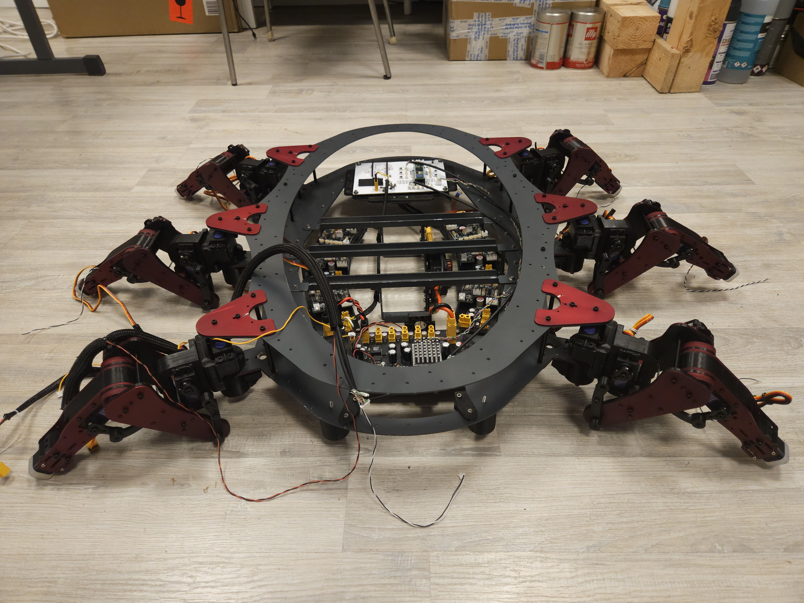

# Hexapod – Modular Six-Leg Robot

  
   
  <em>Closed-loop prototype leg validation test</em>

Work in progress.

This repository documents the development of a custom modular hexapod robot, including mechanics, electronics, sensing, calibration procedures, and system architecture.

Firmware is currently under active development and will be published once the control framework reaches a stable state.

---

# Overview

Custom modular hexapod robot designed from scratch with focus on:

- mechanically serviceable leg modules
- encoder-supervised motion
- repeatable per-joint calibration
- distributed electronics architecture
- robust power and safety management
- expandable sensing and communication architecture
- predictable kinematic behavior

The platform is designed primarily for stable object transport and long-term maintainability rather than high-speed locomotion.

---

# Hardware Architecture

## Mechanical System

- Aluminium laser-cut chassis and structural components
- Modular leg assemblies designed for independent manufacturing, testing, and replacement
- 3D-printed structural and interface parts
- Lever-assisted femur and tibia transmission system for increased joint torque
- Serviceable design with emphasis on maintainability and repeatable assembly

## Electronics & Power

- 4S LiPo power system
- TDK-Lambda i7A high-current converter supplying the global servo power rail
- Dedicated MAIN_power board responsible for:
  - power distribution
  - protection and safety functions
  - UVLO generation and monitoring
- Dedicated MAIN_logic board hosting:
  - Teensy 4.1 real-time controller
  - ESP32 dedicated to external communications and future high-level interfaces
  - communication infrastructure and system diagnostics
- Independent LEG_power module for each leg featuring:
  - protected actuator power distribution
  - BTS443P high-side switching
  - current monitoring and fault detection
- Independent LEG_logic module for each leg featuring:
  - encoder interfaces
  - sensing and diagnostics
  - local communication infrastructure
- Differential communication architecture between controller and leg modules
- Hardware UVLO and power fault management
- Separate logic and servo power domains

## Sensors & Feedback

- Absolute magnetic encoders on all joints
  - AS5600 (I2C)
  - MT6835 (SPI)
- Encoder health monitoring through AGC and MAG diagnostics
- Motion supervision using encoder feedback
- Foot contact detection via microswitches
- Per-leg current monitoring through BTS443P current sense outputs
- Support for individual leg fault detection and future selective leg shutdown strategies
- Provision for future external sensors and expansion modules

---

# Calibration Approach

Each joint is individually calibrated using absolute encoders.

Servo response is characterized and converted into joint-space models used directly by the kinematic system.

Calibration data is used to:

- reduce inter-leg variation
- validate inverse kinematics consistency
- monitor mechanical repeatability
- compensate assembly tolerances and backlash

Representative calibration data and measurements are included in the documentation.

Calibration data is also used for motion validation and diagnostic measurements during development.

---

# Project Gallery

Development images documenting the evolution of the project are available in:

- [Leg Prototype](docs/images/leg_prototype/)
- [Build Progress](docs/images/build_progress/)

The galleries include prototype development, calibration work, mechanical assembly, PCB production, anodizing experiments, and major project milestones.
