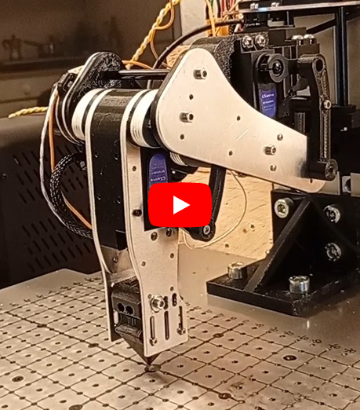

# Hexapod – Modular Six-Leg Robot

  
   
  <em>Closed-loop prototype leg validation test</em>

Work in progress.

This repository documents the development of a custom modular hexapod robot, including mechanics, electronics, sensing, calibration procedures, and system architecture.

Firmware is currently under active development and will be published once the control framework reaches a stable state.

---

# Overview

Custom modular hexapod robot designed from scratch with focus on:

- mechanically serviceable leg modules
- encoder-supervised motion
- repeatable per-joint calibration
- distributed electronics architecture
- robust power and safety management
- expandable sensing and communication architecture
- predictable kinematic behavior

The platform is designed primarily for stable object transport and long-term maintainability rather than high-speed locomotion.

---

# Hardware Architecture

## Mechanical System

- Aluminium laser-cut chassis and leg structures
- Modular leg assemblies
- 3D-printed structural interfaces
- Lever-assisted femur/tibia transmission where required

## Electronics & Power

- Teensy 4.1 real-time controller
- ESP32 dedicated to external communications and future high-level interfaces
- Distributed custom PCBs:
  - central controller board
  - dedicated power board
  - independent leg logic boards
- TDK-Lambda i7A servo power stage
- BTS443P protected high-side switching
- Hardware UVLO and fault handling
- Separate logic and servo power domains

## Sensors & Feedback

- Absolute magnetic encoders on all joints
  - AS5600 (I2C)
  - MT6835 (SPI)
- Encoder health monitoring via AGC/MAG diagnostics
- Motion supervision using encoder feedback
- Foot contact detection via microswitches
- Per-leg current monitoring through BTS443P current sense outputs
- Provision for future external sensors and expansion modules

---

# Calibration Approach

Each joint is individually calibrated using absolute encoders.

Servo response is characterized and converted into joint-space models used directly by the kinematic system.

Calibration data is used to:

- reduce inter-leg variation
- validate inverse kinematics consistency
- monitor mechanical repeatability
- compensate assembly tolerances and backlash

Representative calibration data and measurements are included in the documentation.

Calibration data is also used for motion validation and diagnostic measurements during development.
