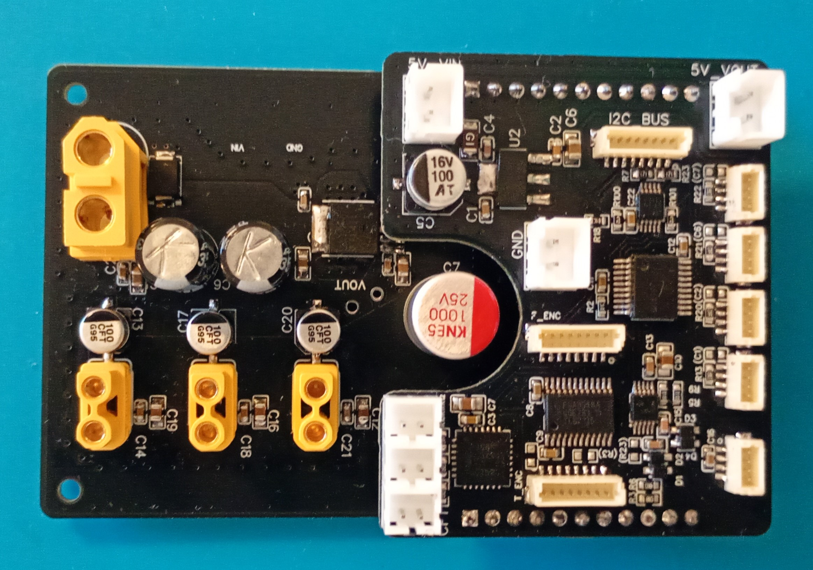

# LEG_power

Per-leg power distribution and protection board used by each hexapod leg.

The board distributes actuator power, provides protection functions, acquires current monitoring data, and serves as the mechanical and electrical base for the LEG_logic module.

LEG_power and LEG_logic are directly interconnected through pin headers, minimizing wiring complexity, reducing susceptibility to electrical interference, and simplifying assembly, testing, and replacement of complete leg modules.

---

# Main Functions

- Actuator power distribution for all leg servos
- BTS443P protected high-side switching
- Individual leg power enable and shutdown capability
- Current monitoring through BTS443P current sense outputs
- Local power filtering and decoupling
- Interface toward the LEG_logic module

---

# Power Architecture

Each leg contains an independent power distribution stage.

The board receives power from the MAIN_power system and distributes it to the local actuators while maintaining fault isolation between leg modules.

Current monitoring signals are routed to the corresponding LEG_logic board for diagnostics and supervision.

---

# Protection & Diagnostics

The board supports:

- Overcurrent protection through BTS443P devices
- Individual leg shutdown through the KILL bus architecture
- Current sensing for diagnostic and fault detection purposes
- Local power integrity monitoring

---

# Design Philosophy

Each leg is equipped with its own dedicated power management module.

This modular approach improves fault isolation, simplifies maintenance, reduces wiring complexity, and allows complete leg assemblies to be tested and replaced independently from the rest of the robot.
