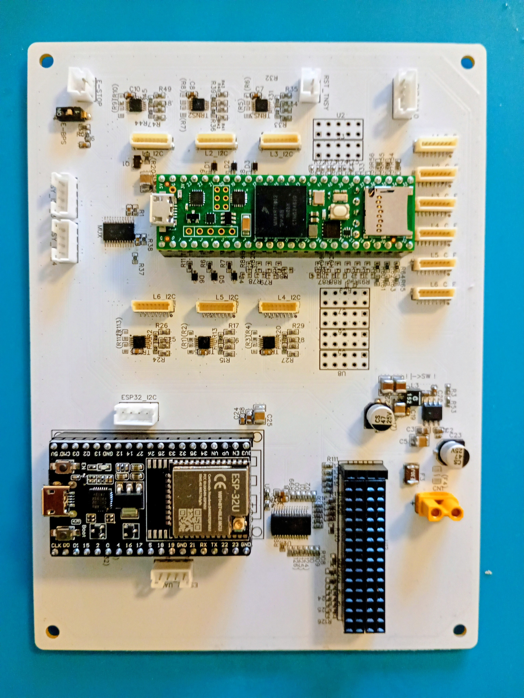

# MAIN_logic

  

Central controller board for the hexapod robot.

The board hosts the real-time robot controller, external communication subsystem, diagnostic interfaces, and system-level power and safety management functions.

---

# Main Functions

- Teensy 4.1 real-time controller
- ESP32 dedicated to external communications and future high-level interfaces
- I2C multiplexing for leg communication channels
- Differential I2C interfaces toward leg modules
- SPI chip-select distribution for coxa encoders
- Individual leg power control through the KILL bus
- Global servo power control through Lambda enable
- UVLO status monitoring from the MAIN_power board
- External safety switch and reset interfaces
- Expansion headers for future sensors and peripherals

---

# Communication Architecture

The Teensy 4.1 manages real-time robot control and low-level hardware supervision.

The ESP32 is used as an external communication and interface processor, keeping non-real-time communication tasks separated from the main control loop.

Leg communication channels are routed through an I2C multiplexer and dedicated differential I2C transceivers.

---

# System Management

The board provides system-level interfaces for:

- Global servo power enable through the Lambda converter
- Individual leg shutdown through the KILL bus
- UVLO status monitoring
- External emergency stop interface
- Teensy reset access
- General-purpose I/O expansion

---

# Design Philosophy

MAIN_logic separates real-time robot control from external communication and system management.

This architecture allows deterministic control on the Teensy while the ESP32 handles external connectivity and future high-level interfaces.

Power distribution, diagnostics, and safety functions are managed independently to improve fault isolation and system maintainability.
