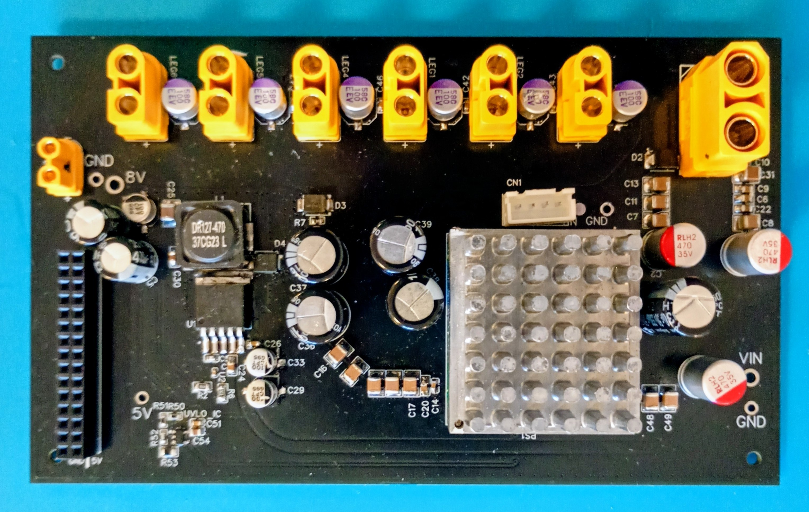

# MAIN_power

Central power distribution and protection board for the hexapod robot.

The board receives power from the main battery, manages the primary power distribution architecture, and provides protection, monitoring, and safety functions for the entire system.

---

# Main Functions

- 4S LiPo battery interface
- Main power distribution
- TDK-Lambda i7A integration
- Global servo power rail generation
- UVLO generation and monitoring
- System-level protection and safety functions
- Power distribution toward all leg modules
- Logic power distribution interfaces

---

# Power Architecture

The board acts as the central power hub of the robot.

Battery power is distributed through dedicated protection stages and converted into a regulated high-current servo power rail through the TDK-Lambda i7A converter.

The resulting power rail is distributed to all LEG_power modules while maintaining centralized supervision and safety control.

---

# Protection & Safety

The board provides:

- Hardware undervoltage lockout (UVLO)
- Global power enable control through the Lambda converter
- Main power protection
- Fault detection interfaces
- System-wide safety integration

---

# Design Philosophy

Power generation, protection, and distribution are centralized within a dedicated module independent from the control electronics.

This architecture simplifies maintenance, improves fault isolation, and allows the power subsystem to evolve independently from the control and sensing electronics.

The board serves as the foundation of the robot's modular electrical architecture.
